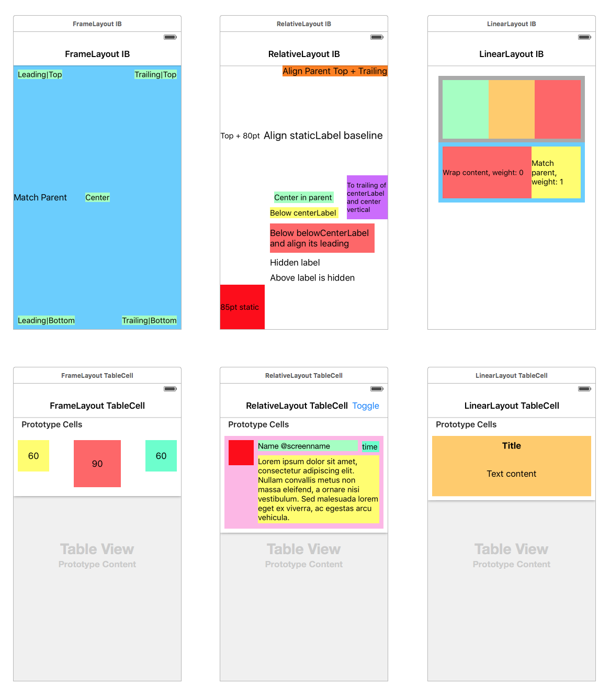

# ALSLayouts

Auto Layout ~~Sucks~~ Substitution

[](https://travis-ci.org/mariotaku/ALSLayouts)
[](http://cocoapods.org/pods/ALSLayouts)
[](http://cocoapods.org/pods/ALSLayouts)
[](http://cocoapods.org/pods/ALSLayouts)

AutoLayout is not easy to learn, especially managing constraints, which is really painful.

ALSLayouts is a set of layouts ported from Android (ported literally, exact same behavior on iOS)



## Example

To run the example project, just execute `pod try ALSLayouts` in terminal.

## Requirements

iOS 8 or later

## Installation

ALSLayouts is available through [CocoaPods](http://cocoapods.org). To install
it, simply add the following line to your Podfile:

```ruby
pod 'ALSLayouts', '~> x.y,z' # Latest version above
```

## Author

Mariotaku Lee, mariotaku.lee@gmail.com

## License

ALSLayouts is available under the MIT license. See the LICENSE file for more info.


## Donation

**Donation methods**

PayPal & AliPay: `let email = "mariotaku.lee@gmail.com"`

Bitcoin: `1Dw9bygK6J3zzKhdtu2gQ7jm73gvp7k59a`

Buy me a ~~bread~~ [game](http://steamcommunity.com/id/mariotaku/wishlist) or anything you want :)

[帮我支付宝账户里随便加点钱](https://twitter.com/xmxsuperstar/status/724094631621750785)

---

Made with ❤️ by <a href="https://mariotaku.org/"></a>
